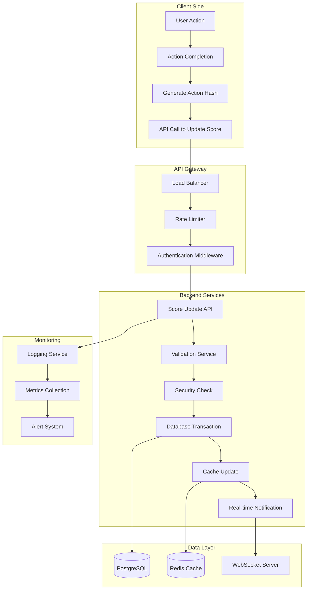
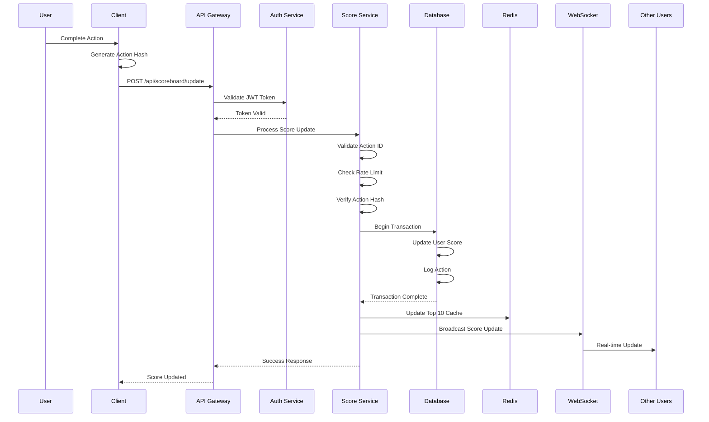
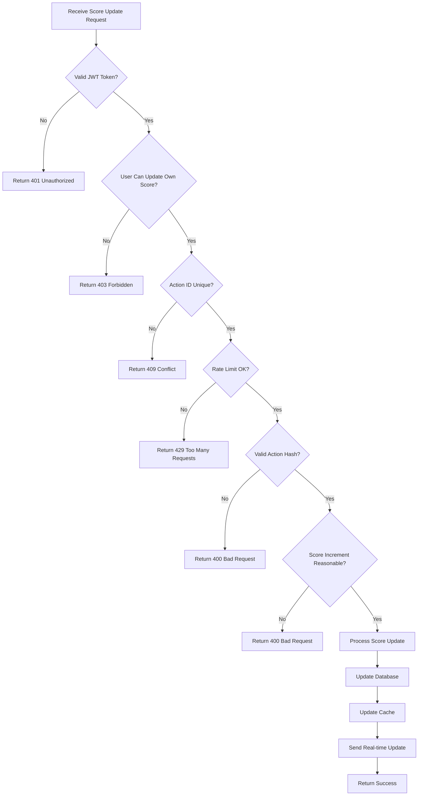
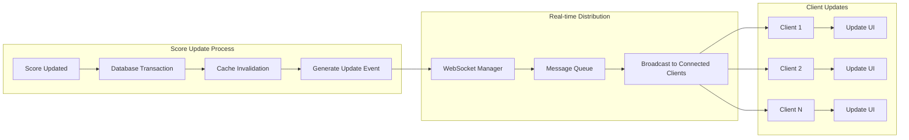
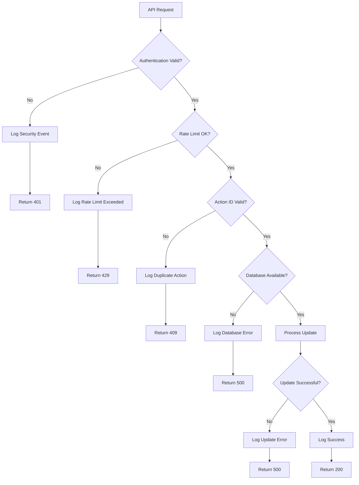
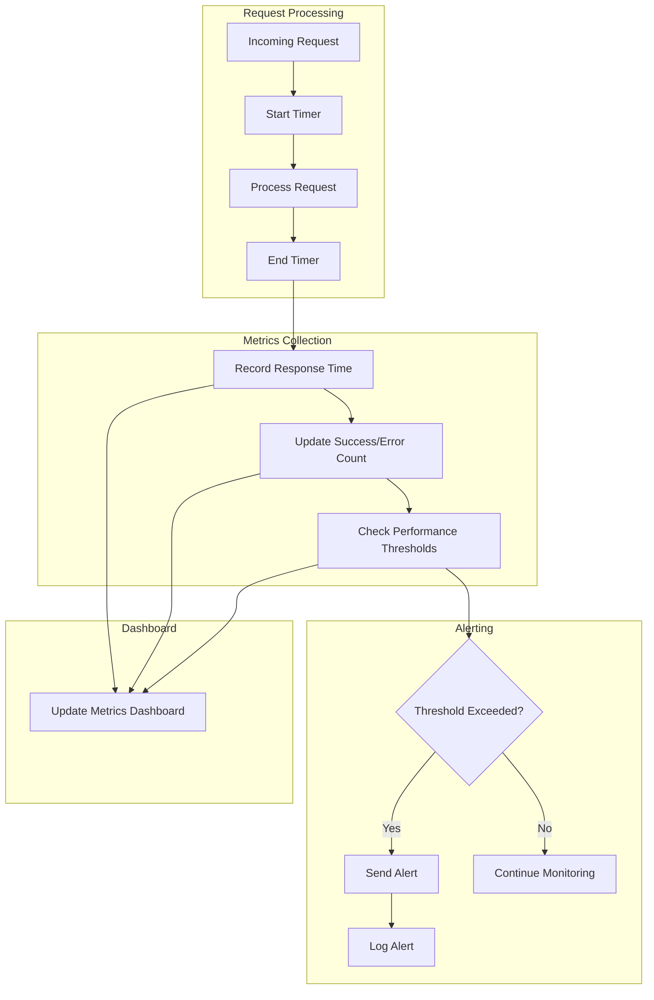
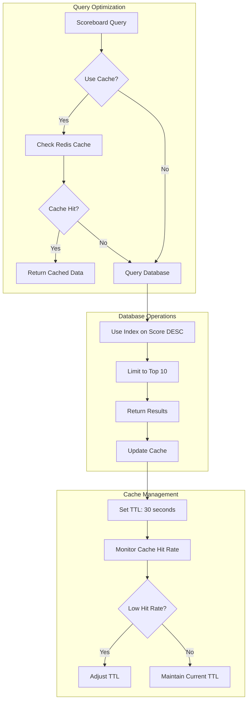
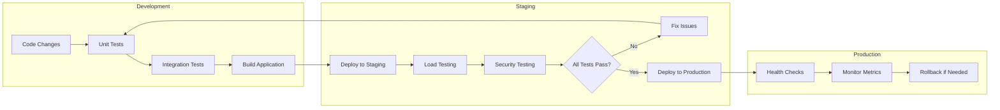
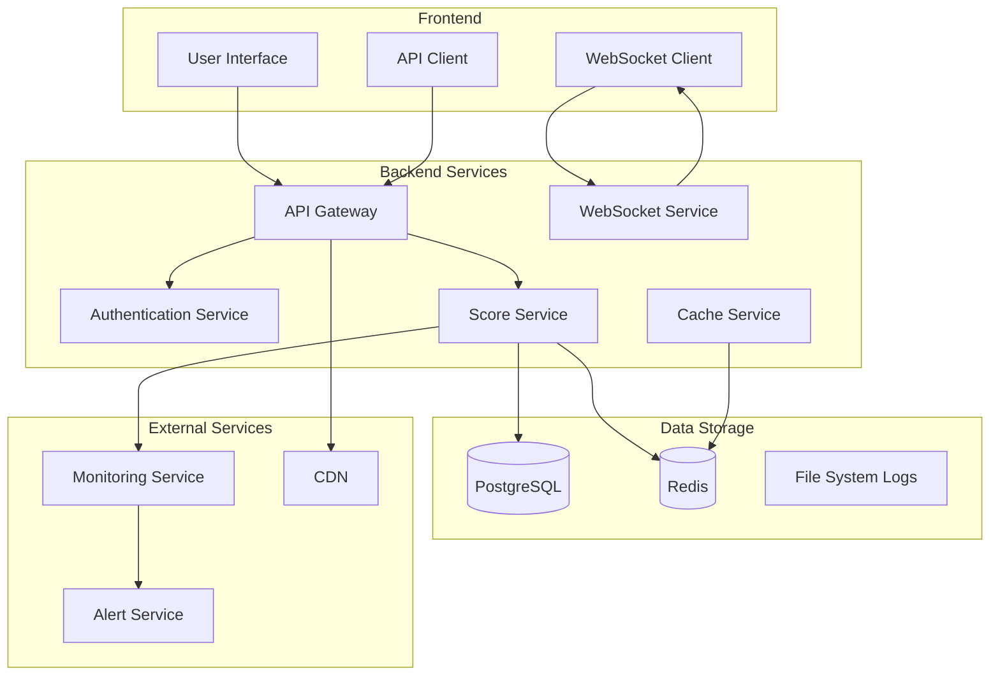

# Scoreboard System Flow Diagram

## System Architecture Overview

## Score Update Flow

## Security Validation Flow

## Real-time Update Flow

## Error Handling Flow

## Performance Monitoring Flow

## Database Optimization Flow

## Deployment Flow

## Key Components Interaction

## Notes on Flow Diagrams

1. **Authentication Flow**: JWT tokens are validated at the API gateway level before any score processing
2. **Security Validation**: Multiple layers of validation prevent unauthorized score manipulation
3. **Real-time Updates**: WebSocket connections provide instant scoreboard updates to all connected clients
4. **Performance**: Caching and database optimization ensure fast response times
5. **Monitoring**: Comprehensive logging and metrics collection for system health
6. **Error Handling**: Graceful error handling with appropriate HTTP status codes
7. **Scalability**: Load balancing and horizontal scaling support for high user volumes
