# Flow Diagrams

## System Architecture

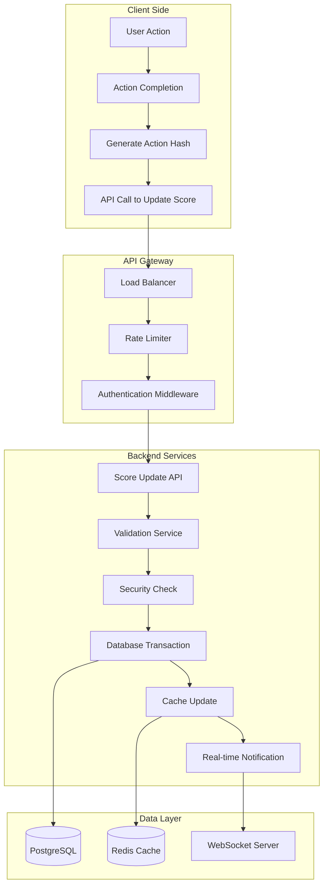
```mermaid
graph TB
    subgraph "Client Side"
        A[User Action] --> B[Action Completion]
        B --> C[Generate Action Hash]
        C --> D[API Call to Update Score]
    end
    
    subgraph "API Gateway"
        E[Load Balancer] --> F[Rate Limiter]
        F --> G[Authentication Middleware]
    end
    
    subgraph "Backend Services"
        H[Score Update API] --> I[Validation Service]
        I --> J[Security Check]
        J --> K[Database Transaction]
        K --> L[Cache Update]
        L --> M[Real-time Notification]
    end
    
    subgraph "Data Layer"
        N[(PostgreSQL)]
        O[(Redis Cache)]
        P[WebSocket Server]
    end
    
    D --> E
    G --> H
    K --> N
    L --> O
    M --> P
```

## Future Architecture Improvements

### Microservices Architecture
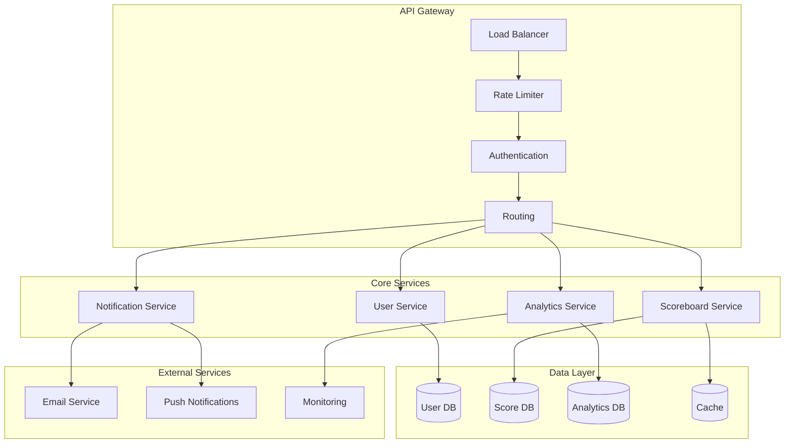
```mermaid
graph TB
    subgraph "API Gateway"
        A[Load Balancer] --> B[Rate Limiter]
        B --> C[Authentication]
        C --> D[Routing]
    end
    
    subgraph "Core Services"
        E[User Service]
        F[Scoreboard Service]
        G[Notification Service]
        H[Analytics Service]
    end
    
    subgraph "Data Layer"
        I[(User DB)]
        J[(Score DB)]
        K[(Analytics DB)]
        L[(Cache)]
    end
    
    subgraph "External Services"
        M[Email Service]
        N[Push Notifications]
        O[Monitoring]
    end
    
    D --> E
    D --> F
    D --> G
    D --> H
    E --> I
    F --> J
    G --> M
    H --> K
    F --> L
    G --> N
    H --> O
```

### Event-Driven Architecture
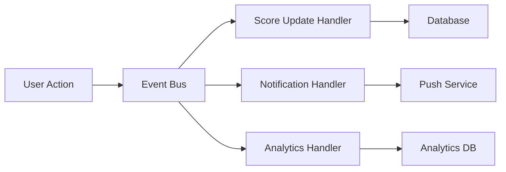
```mermaid
graph LR
    A[User Action] --> B[Event Bus]
    B --> C[Score Update Handler]
    B --> D[Notification Handler]
    B --> E[Analytics Handler]
    C --> F[Database]
    D --> G[Push Service]
    E --> H[Analytics DB]
```

### Multi-Level Caching Strategy
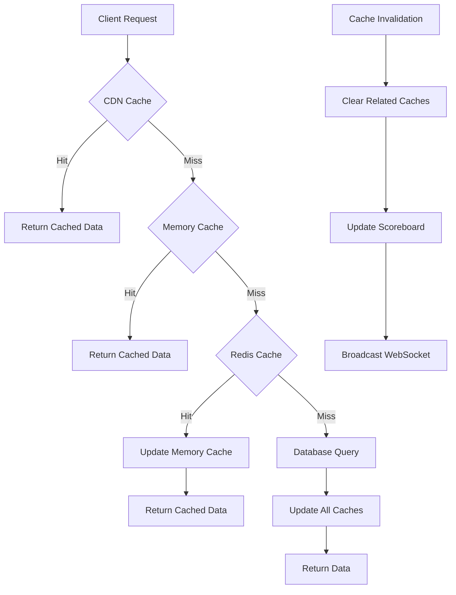
```mermaid
graph TB
    A[Client Request] --> B{CDN Cache}
    B -->|Hit| C[Return Cached Data]
    B -->|Miss| D{Memory Cache}
    D -->|Hit| E[Return Cached Data]
    D -->|Miss| F{Redis Cache}
    F -->|Hit| G[Update Memory Cache]
    G --> H[Return Cached Data]
    F -->|Miss| I[Database Query]
    I --> J[Update All Caches]
    J --> K[Return Data]
    
    L[Cache Invalidation] --> M[Clear Related Caches]
    M --> N[Update Scoreboard]
    N --> O[Broadcast WebSocket]
```

### Cache-Aside Pattern
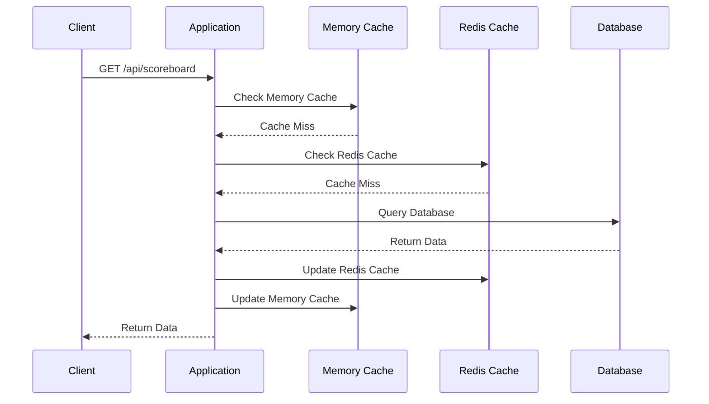
```mermaid
sequenceDiagram
    participant C as Client
    participant A as Application
    participant M as Memory Cache
    participant R as Redis Cache
    participant D as Database
    
    C->>A: GET /api/scoreboard
    A->>M: Check Memory Cache
    M-->>A: Cache Miss
    A->>R: Check Redis Cache
    R-->>A: Cache Miss
    A->>D: Query Database
    D-->>A: Return Data
    A->>R: Update Redis Cache
    A->>M: Update Memory Cache
    A-->>C: Return Data
```

### Write-Through Caching
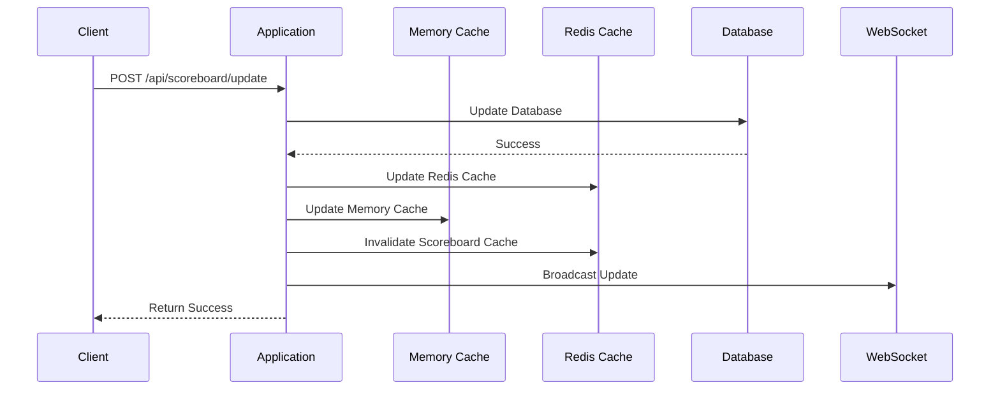
```mermaid
sequenceDiagram
    participant C as Client
    participant A as Application
    participant M as Memory Cache
    participant R as Redis Cache
    participant D as Database
    participant W as WebSocket
    
    C->>A: POST /api/scoreboard/update
    A->>D: Update Database
    D-->>A: Success
    A->>R: Update Redis Cache
    A->>M: Update Memory Cache
    A->>R: Invalidate Scoreboard Cache
    A->>W: Broadcast Update
    A-->>C: Return Success
```

### Cache Warming Strategy
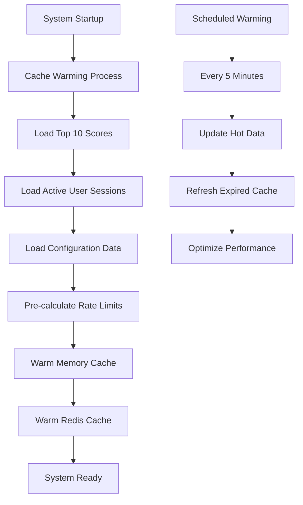
```mermaid
graph TB
    A[System Startup] --> B[Cache Warming Process]
    B --> C[Load Top 10 Scores]
    C --> D[Load Active User Sessions]
    D --> E[Load Configuration Data]
    E --> F[Pre-calculate Rate Limits]
    F --> G[Warm Memory Cache]
    G --> H[Warm Redis Cache]
    H --> I[System Ready]
    
    J[Scheduled Warming] --> K[Every 5 Minutes]
    K --> L[Update Hot Data]
    L --> M[Refresh Expired Cache]
    M --> N[Optimize Performance]
```

### Cache Invalidation Flow
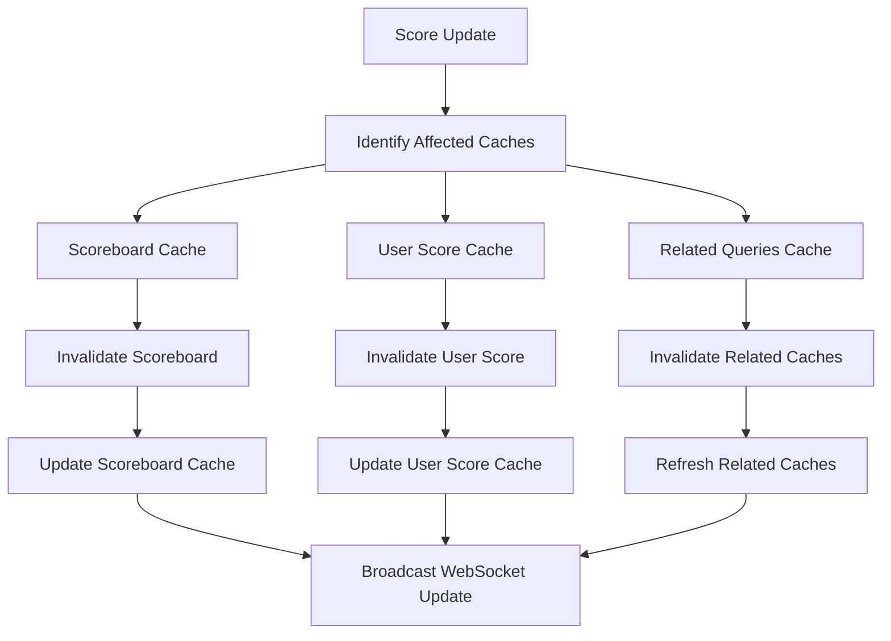
```mermaid
graph TB
    A[Score Update] --> B[Identify Affected Caches]
    B --> C[Scoreboard Cache]
    B --> D[User Score Cache]
    B --> E[Related Queries Cache]
    
    C --> F[Invalidate Scoreboard]
    D --> G[Invalidate User Score]
    E --> H[Invalidate Related Caches]
    
    F --> I[Update Scoreboard Cache]
    G --> J[Update User Score Cache]
    H --> K[Refresh Related Caches]
    
    I --> L[Broadcast WebSocket Update]
    J --> L
    K --> L
```

### Cache Monitoring Flow
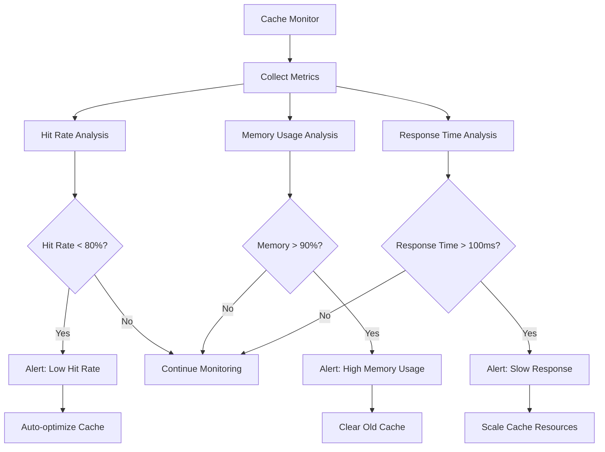
```mermaid
graph TB
    A[Cache Monitor] --> B[Collect Metrics]
    B --> C[Hit Rate Analysis]
    B --> D[Memory Usage Analysis]
    B --> E[Response Time Analysis]
    
    C --> F{Hit Rate < 80%?}
    F -->|Yes| G[Alert: Low Hit Rate]
    F -->|No| H[Continue Monitoring]
    
    D --> I{Memory > 90%?}
    I -->|Yes| J[Alert: High Memory Usage]
    I -->|No| H
    
    E --> K{Response Time > 100ms?}
    K -->|Yes| L[Alert: Slow Response]
    K -->|No| H
    
    G --> M[Auto-optimize Cache]
    J --> N[Clear Old Cache]
    L --> O[Scale Cache Resources]
```

## Performance Optimization Flows

### Database Optimization
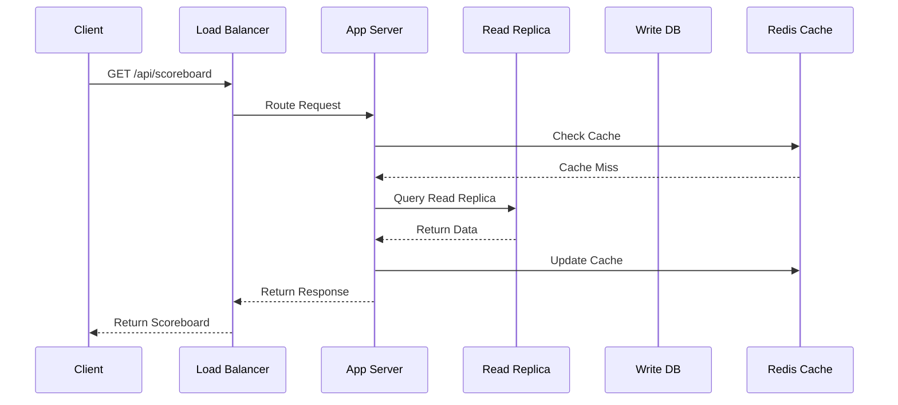
```mermaid
sequenceDiagram
    participant C as Client
    participant L as Load Balancer
    participant A as App Server
    participant R as Read Replica
    participant W as Write DB
    participant Cache as Redis Cache
    
    C->>L: GET /api/scoreboard
    L->>A: Route Request
    A->>Cache: Check Cache
    Cache-->>A: Cache Miss
    A->>R: Query Read Replica
    R-->>A: Return Data
    A->>Cache: Update Cache
    A-->>L: Return Response
    L-->>C: Return Scoreboard
```

### WebSocket Optimization
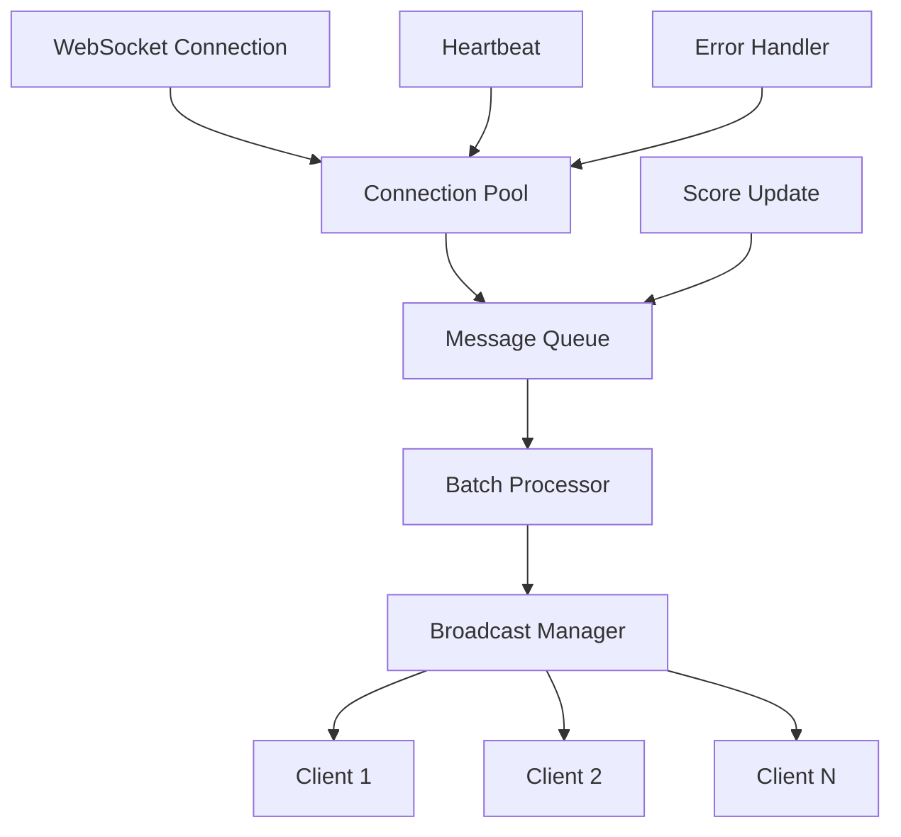
```mermaid
graph TB
    A[WebSocket Connection] --> B[Connection Pool]
    B --> C[Message Queue]
    C --> D[Batch Processor]
    D --> E[Broadcast Manager]
    E --> F[Client 1]
    E --> G[Client 2]
    E --> H[Client N]
    
    I[Score Update] --> C
    J[Heartbeat] --> B
    K[Error Handler] --> B
```

## Security Enhancement Flows

### Multi-Factor Authentication
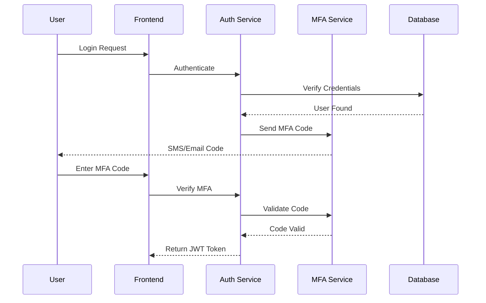
```mermaid
sequenceDiagram
    participant U as User
    participant F as Frontend
    participant A as Auth Service
    participant M as MFA Service
    participant D as Database
    
    U->>F: Login Request
    F->>A: Authenticate
    A->>D: Verify Credentials
    D-->>A: User Found
    A->>M: Send MFA Code
    M-->>U: SMS/Email Code
    U->>F: Enter MFA Code
    F->>A: Verify MFA
    A->>M: Validate Code
    M-->>A: Code Valid
    A-->>F: Return JWT Token
```

### Fraud Detection
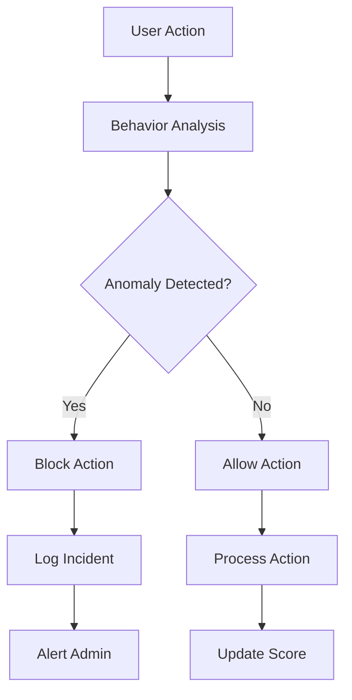
```mermaid
graph TB
    A[User Action] --> B[Behavior Analysis]
    B --> C{Anomaly Detected?}
    C -->|Yes| D[Block Action]
    C -->|No| E[Allow Action]
    D --> F[Log Incident]
    E --> G[Process Action]
    F --> H[Alert Admin]
    G --> I[Update Score]
```

## Monitoring and Observability

### Health Check Flow
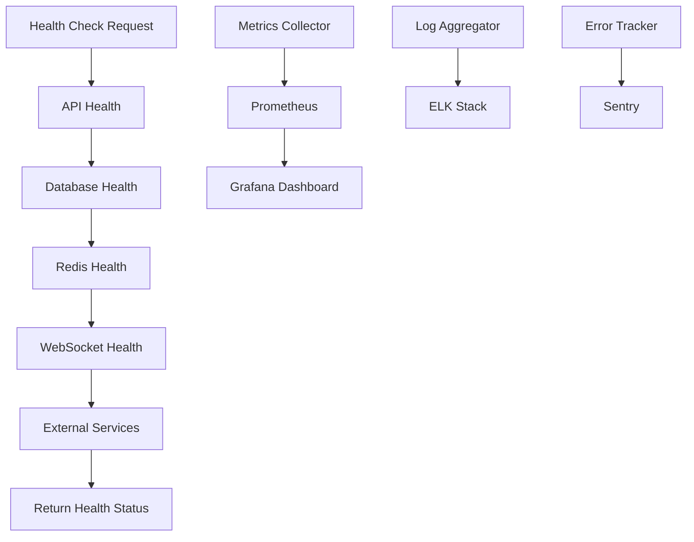
```mermaid
graph TB
    A[Health Check Request] --> B[API Health]
    B --> C[Database Health]
    C --> D[Redis Health]
    D --> E[WebSocket Health]
    E --> F[External Services]
    F --> G[Return Health Status]
    
    H[Metrics Collector] --> I[Prometheus]
    I --> J[Grafana Dashboard]
    K[Log Aggregator] --> L[ELK Stack]
    M[Error Tracker] --> N[Sentry]
```

### Alerting Flow
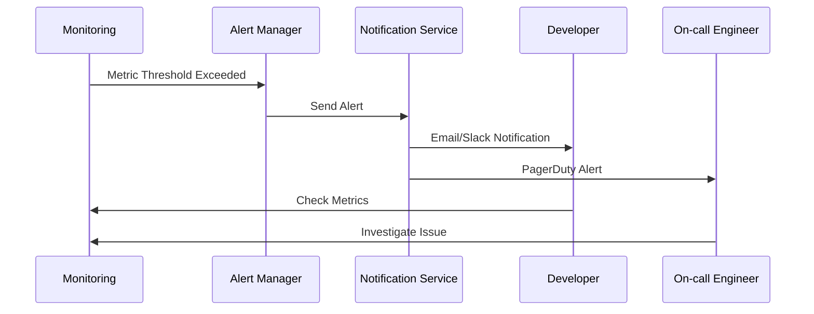
```mermaid
sequenceDiagram
    participant M as Monitoring
    participant A as Alert Manager
    participant N as Notification Service
    participant D as Developer
    participant O as On-call Engineer
    
    M->>A: Metric Threshold Exceeded
    A->>N: Send Alert
    N->>D: Email/Slack Notification
    N->>O: PagerDuty Alert
    D->>M: Check Metrics
    O->>M: Investigate Issue
```

## Score Update Flow

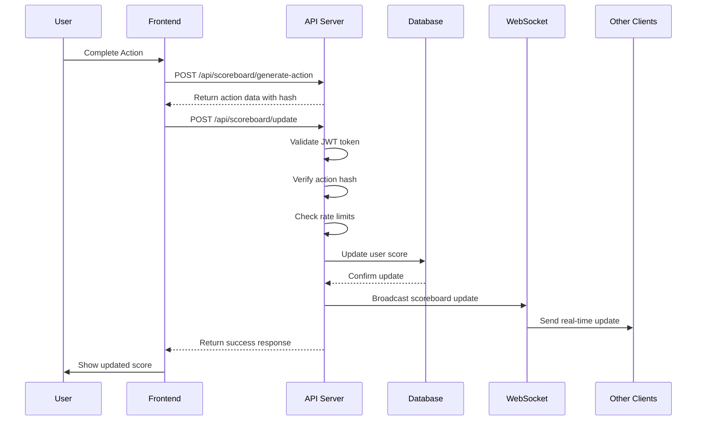
```mermaid
sequenceDiagram
    participant U as User
    participant F as Frontend
    participant A as API Server
    participant D as Database
    participant W as WebSocket
    participant C as Other Clients
    
    U->>F: Complete Action
    F->>A: POST /api/scoreboard/generate-action
    A-->>F: Return action data with hash
    F->>A: POST /api/scoreboard/update
    A->>A: Validate JWT token
    A->>A: Verify action hash
    A->>A: Check rate limits
    A->>D: Update user score
    D-->>A: Confirm update
    A->>W: Broadcast scoreboard update
    W->>C: Send real-time update
    A-->>F: Return success response
    F->>U: Show updated score
```

## Authentication Flow

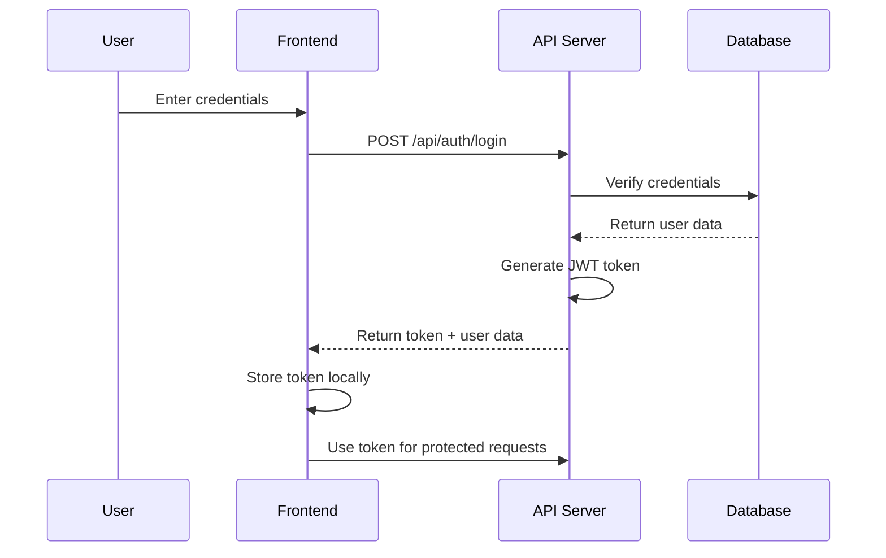
```mermaid
sequenceDiagram
    participant U as User
    participant F as Frontend
    participant A as API Server
    participant D as Database
    
    U->>F: Enter credentials
    F->>A: POST /api/auth/login
    A->>D: Verify credentials
    D-->>A: Return user data
    A->>A: Generate JWT token
    A-->>F: Return token + user data
    F->>F: Store token locally
    F->>A: Use token for protected requests
```

## Security Validation Flow

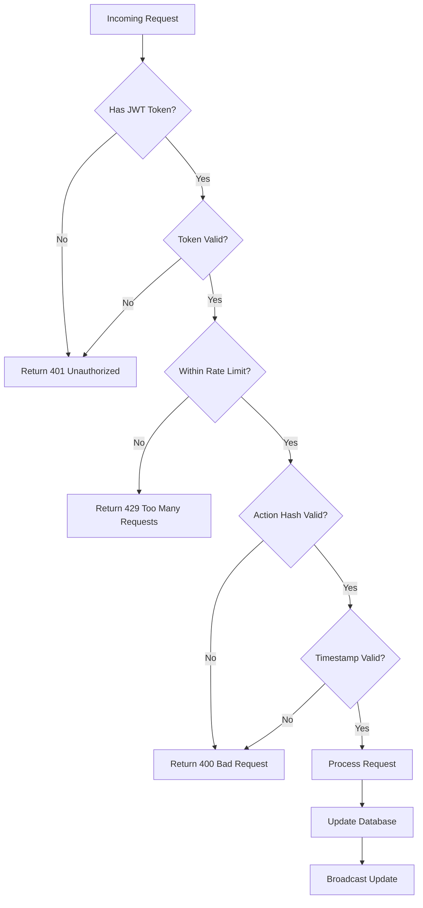
```mermaid
flowchart TD
    A[Incoming Request] --> B{Has JWT Token?}
    B -->|No| C[Return 401 Unauthorized]
    B -->|Yes| D{Token Valid?}
    D -->|No| C
    D -->|Yes| E{Within Rate Limit?}
    E -->|No| F[Return 429 Too Many Requests]
    E -->|Yes| G{Action Hash Valid?}
    G -->|No| H[Return 400 Bad Request]
    G -->|Yes| I{Timestamp Valid?}
    I -->|No| H
    I -->|Yes| J[Process Request]
    J --> K[Update Database]
    K --> L[Broadcast Update]
```

## Real-time Update Flow

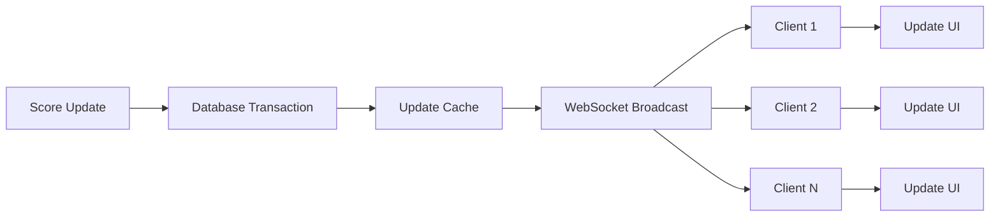
```mermaid
graph LR
    A[Score Update] --> B[Database Transaction]
    B --> C[Update Cache]
    C --> D[WebSocket Broadcast]
    D --> E[Client 1]
    D --> F[Client 2]
    D --> G[Client N]
    E --> H[Update UI]
    F --> I[Update UI]
    G --> J[Update UI]
```

## Error Handling Flow

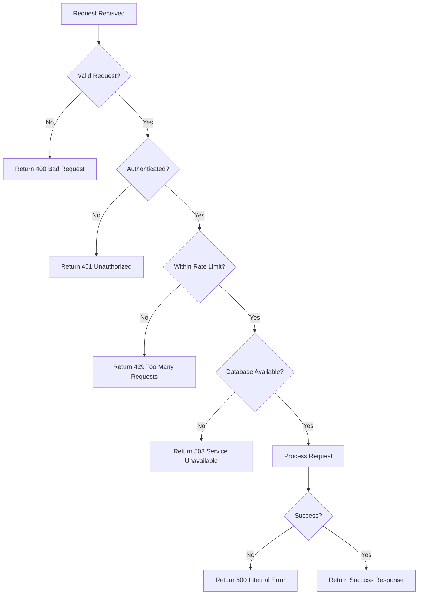
```mermaid
flowchart TD
    A[Request Received] --> B{Valid Request?}
    B -->|No| C[Return 400 Bad Request]
    B -->|Yes| D{Authenticated?}
    D -->|No| E[Return 401 Unauthorized]
    D -->|Yes| F{Within Rate Limit?}
    F -->|No| G[Return 429 Too Many Requests]
    F -->|Yes| H{Database Available?}
    H -->|No| I[Return 503 Service Unavailable]
    H -->|Yes| J[Process Request]
    J --> K{Success?}
    K -->|No| L[Return 500 Internal Error]
    K -->|Yes| M[Return Success Response]
```

## Database Operations Flow

```mermaid
sequenceDiagram
    participant A as API Server
    participant P as Prisma ORM
    participant D as PostgreSQL
    participant R as Redis Cache
    
    A->>P: Update Score Request
    P->>D: Begin Transaction
    D-->>P: Transaction Started
    P->>D: Update User Score
    D-->>P: Score Updated
    P->>D: Log Action
    D-->>P: Action Logged
    P->>D: Commit Transaction
    D-->>P: Transaction Committed
    P-->>A: Success Response
    A->>R: Update Cache
    R-->>A: Cache Updated
    A->>A: Broadcast WebSocket Update
```