# Flow Diagrams

## System Architecture


## Current Architecture Overview

> **✅ Current Implementation**: The system currently uses **monolithic architecture** with Fastify framework, not microservices.

### 🏗️ Current Tech Stack
- **Backend**: Fastify + TypeScript
- **Database**: PostgreSQL with Prisma ORM
- **Cache**: Redis with multi-level caching (Memory + Redis)
- **Real-time**: WebSocket with custom WebSocketService
- **Authentication**: JWT tokens
- **Rate Limiting**: Custom cache-based rate limiting
- **Documentation**: Swagger/OpenAPI

### 🚫 Not Currently Implemented
- ❌ Microservices architecture
- ❌ Email service
- ❌ Analytics service  
- ❌ Push notifications
- ❌ Advanced monitoring (Prometheus/Grafana)
- ❌ Multi-Factor Authentication (MFA)
- ❌ Fraud detection system

## Future Architecture Improvements

> **📝 Note**: The architectures below are future development plans, not current implementation.

### 🚀 Phase 2: Microservices Architecture

```mermaid
graph TB
    subgraph "API Gateway"
        A[Load Balancer] --> B[Rate Limiter]
        B --> C[Authentication]
        C --> D[Routing]
    end
    
    subgraph "Core Services (Future)"
        E[User Service<br/>🔮 Future]
        F[Scoreboard Service<br/>🔮 Future]
        G[Notification Service<br/>🔮 Future]
        H[Analytics Service<br/>🔮 Future]
    end
    
    subgraph "Data Layer (Future)"
        I[(User DB<br/>🔮 Future)]
        J[(Score DB<br/>🔮 Future)]
        K[(Analytics DB<br/>🔮 Future)]
        L[(Cache<br/>🔮 Future)]
    end
    
    subgraph "External Services (Future)"
        M[Email Service<br/>🔮 Future]
        N[Push Notifications<br/>🔮 Future]
        O[Monitoring<br/>🔮 Future]
    end
    
    D --> E
    D --> F
    D --> G
    D --> H
    E --> I
    F --> J
    G --> M
    H --> K
    F --> L
    G --> N
    H --> O
```


### 🔮 Phase 3: Event-Driven Architecture (Future)

```mermaid
graph LR
    A[User Action] --> B[Event Bus<br/>🔮 Future]
    B --> C[Score Update Handler<br/>🔮 Future]
    B --> D[Notification Handler<br/>🔮 Future]
    B --> E[Analytics Handler<br/>🔮 Future]
    C --> F[Database]
    D --> G[Push Service<br/>🔮 Future]
    E --> H[Analytics DB<br/>🔮 Future]
```


### Multi-Level Caching Strategy


### Cache-Aside Pattern


### Write-Through Caching


### Cache Warming Strategy


### Cache Invalidation Flow


### Cache Monitoring Flow


## Performance Optimization Flows

### Database Optimization


### WebSocket Optimization


## Security Enhancement Flows

### 🔮 Phase 4: Multi-Factor Authentication (Future)

```mermaid
sequenceDiagram
    participant U as User
    participant F as Frontend
    participant A as Auth Service
    participant M as MFA Service<br/>🔮 Future
    participant D as Database
    
    U->>F: Login Request
    F->>A: Authenticate
    A->>D: Verify Credentials
    D-->>A: User Found
    A->>M: Send MFA Code<br/>🔮 Future
    M-->>U: SMS/Email Code<br/>🔮 Future
    U->>F: Enter MFA Code
    F->>A: Verify MFA
    A->>M: Validate Code<br/>🔮 Future
    M-->>A: Code Valid<br/>🔮 Future
    A-->>F: Return JWT Token
```


### 🔮 Phase 5: Fraud Detection (Future)

```mermaid
graph TB
    A[User Action] --> B[Behavior Analysis<br/>🔮 Future]
    B --> C{Anomaly Detected?<br/>🔮 Future}
    C -->|Yes| D[Block Action<br/>🔮 Future]
    C -->|No| E[Allow Action]
    D --> F[Log Incident<br/>🔮 Future]
    E --> G[Process Action]
    F --> H[Alert Admin<br/>🔮 Future]
    G --> I[Update Score]
```


## Monitoring and Observability

### Health Check Flow (Current Implementation)


> **Current Implementation**: The health check endpoint returns system status including cache statistics and WebSocket connection count.

### 🔮 Phase 6: Advanced Alerting Flow (Future)

```mermaid
sequenceDiagram
    participant M as Monitoring<br/>🔮 Future
    participant A as Alert Manager<br/>🔮 Future
    participant N as Notification Service<br/>🔮 Future
    participant D as Developer
    participant O as On-call Engineer<br/>🔮 Future
    
    M->>A: Metric Threshold Exceeded<br/>🔮 Future
    A->>N: Send Alert<br/>🔮 Future
    N->>D: Email/Slack Notification<br/>🔮 Future
    N->>O: PagerDuty Alert<br/>🔮 Future
    D->>M: Check Metrics<br/>🔮 Future
    O->>M: Investigate Issue<br/>🔮 Future
```


## Score Update Flow


> **Current Implementation**: This flow shows the actual score update process with JWT authentication, action hash verification, and real-time WebSocket broadcasting.

## Authentication Flow


> **Current Implementation**: Authentication uses JWT tokens with bcrypt password hashing and Prisma ORM for database operations.

## Security Validation Flow


## WebSocket Connection Flow


> **Current Implementation**: WebSocket connections are managed by a custom WebSocketService with connection tracking and real-time broadcasting capabilities.

## Real-time Update Flow


## Error Handling Flow

```mermaid
flowchart TD
    A[Request Received] --> B{Valid Request?}
    B -->|No| C[Return 400 Bad Request]
    B -->|Yes| D{Authenticated?}
    D -->|No| E[Return 401 Unauthorized]
    D -->|Yes| F{Within Rate Limit?}
    F -->|No| G[Return 429 Too Many Requests]
    F -->|Yes| H{Database Available?}
    H -->|No| I[Return 503 Service Unavailable]
    H -->|Yes| J[Process Request]
    J --> K{Success?}
    K -->|No| L[Return 500 Internal Error]
    K -->|Yes| M[Return Success Response]
```

## Database Operations Flow

```mermaid
sequenceDiagram
    participant A as Fastify Server
    participant SC as ScoreboardController
    participant P as Prisma ORM
    participant D as PostgreSQL
    participant C as CacheService
    participant W as WebSocketService
    
    A->>SC: Score Update Request
    SC->>P: Begin Transaction
    P->>D: BEGIN TRANSACTION
    D-->>P: Transaction Started
    P->>D: UPDATE scores SET score = score + ?
    D-->>P: Score Updated
    P->>D: INSERT INTO action_logs
    D-->>P: Action Logged
    P->>D: COMMIT TRANSACTION
    D-->>P: Transaction Committed
    P-->>SC: Return Updated Score
    SC->>C: Invalidate scoreboard cache
    SC->>C: Update user score cache
    C-->>SC: Cache Updated
    SC->>W: Broadcast scoreboard update
    W->>W: Send to all connected clients
    SC-->>A: Success Response
    A-->>A: Return to client
```

> **Current Implementation**: Database operations use Prisma ORM with transaction support, cache invalidation, and real-time WebSocket broadcasting.